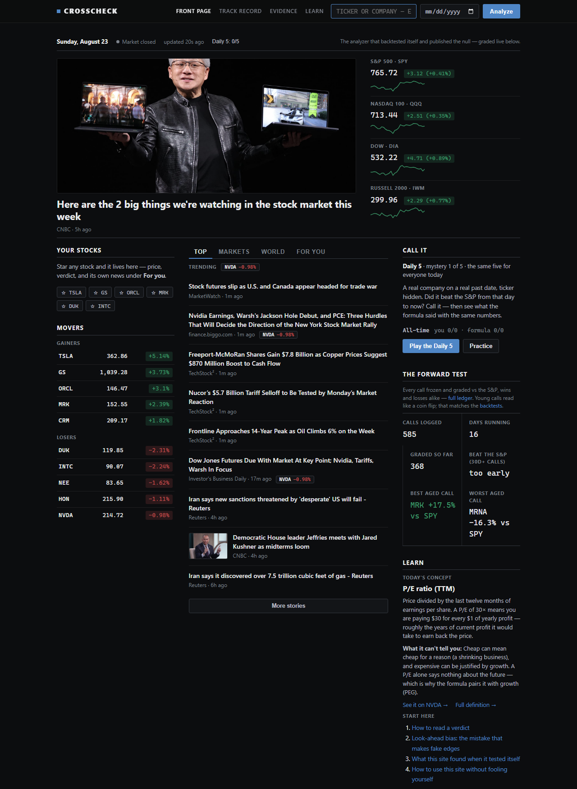
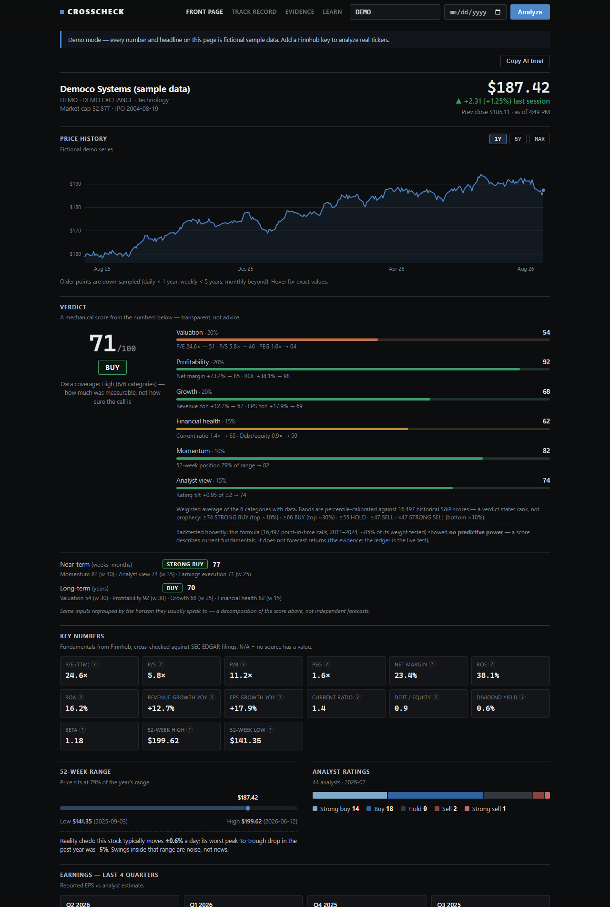

# Crosscheck — the honest stock analyzer


Type a ticker, get the whole picture: live quote, company profile, fundamentals
cross-checked against SEC filings, analyst ratings, earnings history, peers,
relevance-filtered news — and a transparent 0–100 verdict (STRONG BUY → STRONG
SELL) you can pick apart category by category, from an analyzer that
publishes its own backtests ([EVIDENCE.md](EVIDENCE.md) — including the ones
that came back null).

Free and MIT-licensed; runs on your machine with your own free API keys.
Non-programmer setup guide: [FRIENDS_SETUP.md](FRIENDS_SETUP.md).

**Run it like an app (Windows):** double-click `Start Crosscheck app.vbs` once,
then run `scripts\install_shortcut.ps1` to get a Crosscheck icon on your desktop
and Start Menu — it launches the server silently and opens its own app window
(no terminal, no browser tabs). `Stop Crosscheck.bat` shuts the server down.
On any OS, Chrome's own Install button (in the address bar) installs it as an
app too, as long as the server is running.





**Not financial advice.** Research/education only. Data can be delayed,
incomplete, or wrong; the verdict is a mechanical formula, not a recommendation.

## How it works

- **Backend** (Node.js + Express) owns all API keys — nothing sensitive ever
  reaches the browser. One endpoint does the work:
  `GET /api/analyze?ticker=SYMBOL` returns a single JSON payload.
- **Financial data** comes from [Finnhub](https://finnhub.io) (free tier):
  quote, profile, `/stock/metric?metric=all` fundamentals, recommendation
  trends, earnings, peers.
- **SEC EDGAR cross-check** (no key, public-domain): fundamentals are also
  computed from as-filed XBRL company facts (TTM assembled from quarterlies,
  incl. the synthesized Q4 = 10-K minus three 10-Qs). EDGAR values fill
  Finnhub's gaps (marked `SEC` on the tile), agreements get a `✓`, and
  disagreements get a `⚠` with both values on hover plus a warning — bad
  vendor data can't silently drive a verdict anymore. Keyless mode now shows
  real fundamentals too.
- **Tiingo** (optional free key): fresh split/dividend-adjusted closes for
  tickers the local panel doesn't cover — live chart + 52-week stats for any
  US name, and total-return ledger grading instead of the raw-quote fallback.
  It also unlocks the Time Machine and the homepage moments row, and powers
  the grading behind the daily game — the key that makes the fun parts work.
- **News** is aggregated server-side from Google News RSS (spans hundreds of
  publishers), Yahoo Finance RSS, and Finnhub company-news — parsed, filtered
  for relevance (every item must mention the company's core name, a distinctive
  name word, or the ticker as a real token — entity-tagged feeds drift, e.g.
  SpaceX stories filed under TSLA), near-duplicate headlines removed, newest
  first, top 15. The RSS sources need no key.
- **Scoring** (`lib/scoring.js`) is fully transparent: each metric maps to 0–100
  through visible piecewise-linear anchors, metrics average into six weighted
  categories (Valuation 20 / Profitability 20 / Growth 20 / Health 15 /
  Momentum 10 / Analyst 15), weights renormalize over whatever data exists, and
  the UI shows every sub-score. Fewer than two scorable categories → an honest
  "NOT ENOUGH DATA" instead of a fake verdict.
- **Market overview homepage**: the landing page opens on live index levels
  (S&P 500, Nasdaq 100, Dow, Russell 2000 via ETF proxies), today's biggest
  gainers and losers across the batch universe,
  aggregated market headlines, the forward test's own live record tiles
  (calls logged, hit rate once enough calls age — losses included), and a
  row of curated Time Machine moments to explore. Everything is served from
  shared server caches, so the front page stays inside free-tier limits no
  matter how many people load it. Keyless, the headlines still flow (RSS
  needs no key).
- **Verdict screen**: a browsable, scrollable ranking of the entire fixed
  50-stock batch universe by the formula's latest logged score and verdict,
  with filter chips and sortable columns. Click any row for the full
  analysis. Every call shown is graded on the track record page.
- **The official forward test travels with the app.** The daily 50-stock
  experiment runs on the project's machine; its call log — the formula's
  own output only (ticker, date, score, verdict — no market data) — is
  published to `docs/forward-test.json` and updated each trading day. A
  fresh install's verdict screen and track record show the official calls
  immediately and grade them locally with your own keys, so you can verify
  every number yourself. Your personal picks are always yours and stay
  local; run `npm run batch` if you'd rather build your own ledger instead.
- **Visual, not just tabular**: a sector heat map of the whole batch
  universe colored by today's move, an advancing/declining breadth bar, and
  30-session sparklines on every index tile and watchlist row. Background
  sweeps are budget-aware — they yield whenever the rolling minute of
  Finnhub calls gets full, so an interactive analysis never 429s because the
  heat map was refreshing.
- **Learn as you look** (`/learn.html`): eleven short lessons built on live
  data — reading a verdict, valuation vs quality vs health, look-ahead bias,
  total return, and what this site found when it tested itself — plus a
  26-term plain-English glossary and an interactive P/E → years → PEG
  calculator. Every key number on a result page has a `?` that opens its
  definition in place: what it is, and what it can't tell you. The homepage
  rotates one concept a day with a live example.
- **Beyond stocks**: a macro strip with the six numbers that explain most
  red days — VIX, the 10-year Treasury yield, oil, gold, Bitcoin, and
  EUR/USD — plus an economic calendar (Fed decisions, jobs reports, options
  expiries; only dependable dates, nothing guessed) and this week's
  earnings from the universe, each row one click from the full analysis.
- **Your portfolio, honestly benchmarked**: enter what you actually own
  (with buy dates) and get live value, profit/loss, and the comparison
  most brokers never show — would the same money in the S&P, dividends
  included, have done better? Positions live only in your browser.
- **The economy right now**: inflation, unemployment, the Fed funds rate,
  the 30-year mortgage, and the 10yr−3mo yield spread (the classic
  recession signal, flagged when inverted) — straight from FRED, the
  St. Louis Fed's public data service, keyless.
- **World markets and sectors**: S&P and Nasdaq futures (they trade nearly
  around the clock), Tokyo/Hong Kong/Frankfurt/London, and the 11 sector
  ETFs ranked by day and month — where the money rotated.
- **Insider radar**: open-market buys by executives and directors across
  the universe (SEC Form 4), surfaced when two or more distinct insiders
  bought — insiders sell for many reasons, but they only buy for one.
- **IPO calendar** and an **SEC filings feed** for the stocks you follow —
  8-Ks straight from EDGAR, often before the news story about them.
- **Price alerts** (honest about their one limit: checked while the app is
  open — a local tool can't fire when it's closed), a **crypto strip**
  (change window stated exactly), and a portfolio **dividend line** that
  reports what was actually paid over the last 12 months, never a forecast.
- **A real front page**: newspaper hierarchy — a hero lead story, a today
  bar (market open/closed, live "updated Xs ago", your visit streak), and
  three columns: your portfolio and watchlist, the news feed, and the forward-test/record rail.
- **Feed tabs — Briefing / For you / Markets / World / Filings**: world and business news
  from Google's topic feeds (keyless) merged with the wire items; **For
  you** builds a feed from the stocks you've starred — company news per
  ticker, keyless, relevance-filtered. A Newer / Older pager pages through each tab.
- **Watchlist**: star any stock anywhere (screen rows, suggestions) and it
  lives in "Your stocks" — live price, today's move, and the formula's
  latest verdict side by side — and powers the For you feed.
- **News that pops**: every headline tagged with the universe tickers it
  mentions (with today's move, clickable), and a "trending" row derived
  from those mentions. Change badges and refresh-flash on the index strip;
  verdict dots on every heat-map tile.
- **Cold-start friendly**: the 50-quote movers sweep runs in the background
  and the endpoint answers progressively (partial payloads, the page
  re-polls every 4s), concurrent loads share one computation, and refreshes
  are stale-while-revalidate — so the first screen is never blank and a
  fresh launch never rate-limits your first analysis.
- **Fast to drive**: search-as-you-type company lookup ("coca cola" → KO)
  with arrow-key navigation, a recently-viewed row on the homepage, sortable
  and filterable verdict screen (Buys / Holds / Sells), "/" focuses search
  from anywhere, and the browser back button returns to the market overview.
- **Live prices, not delayed:** the quote refreshes on every request even when
  the heavy payload is served from cache (1 API call instead of ~7), and while
  a result is on screen the price block streams real-time trades from
  Finnhub's free websocket (relayed server-side over SSE, throttled to 1
  update/sec, auto-quiet outside market hours). Charts and ledger grading
  stay end-of-day on purpose — grading is close-to-close by design.
- **Time Machine**: pick any ticker and any date back to 2010 (date field
  next to search) and see exactly what the formula would have said with only
  that day's filings and prices — filing lags included, no hindsight — then
  how the frozen call aged against SPY. Try the landing-page chip: NVDA on
  2023-01-03 reads SELL… the stock then beat the S&P by about +1,370% (Study 2 in EVIDENCE.md). The honesty claim, interactive.
- **Since you last looked**: revisit a ticker on a later day and the page
  opens with what moved — score, filings, insider activity, earnings date.
- **Share card**: one click renders the verdict as a PNG with the
  no-predictive-power evidence line baked into the pixels, so a shared
  screenshot carries its own disclaimer. Press `/` anywhere to search.
- Sources are fetched in parallel; any single source failing degrades that
  section to N/A and adds a warning — it never breaks the page.
- **Price history chart**: with a Tiingo key, any US ticker gets a live
  split/dividend-adjusted chart. Optionally, local parquet datasets can serve
  as a chart source instead (see `.env.example`) — without either, the chart
  section simply doesn't render and everything else still works.
- **Horizon views** — alongside the overall verdict, the same categories are
  regrouped by the horizon they usually speak to: *Near-term (weeks–months)* =
  momentum + analyst tilt + earnings execution (beat rate and average surprise
  over the last 4 quarters); *Long-term (years)* = valuation + profitability +
  growth + financial health. This is a decomposition of the one dataset, not
  two independent forecasts — a stock can honestly read "near-term SELL,
  long-term BUY" (classic value-trap shape) and the UI says exactly which
  numbers drive each side. Both horizon calls are logged to the Verdict Ledger
  so time can grade them separately.
- **Verdict Ledger** (`/ledger.html`) — a *forward* test of the verdicts.
  Every real analysis logs its call (verdict, score, price, and SPY's level at
  that moment) to `data/verdict_ledger.json`: first call per ticker per day,
  append-only, never edited, stamped with the scoring-formula version. The
  ledger page charts every graded call (the calls map) and grades them —
  do the BUYs actually beat SPY, and by more than the SELLs? This is deliberately *not* a historical backtest:
  backtesting a hand-tuned formula on data you can re-run until it looks good
  is how people fool themselves. Logging calls first and letting time grade
  them is the version that can't cheat. Expect months, not days, before the
  numbers mean anything.
- **Grading is total-return and split-safe.** Calls are graded from the local
  research panel's split- and dividend-adjusted closes (last close on/before
  the call date → latest close), with SPY's adjusted series (Yahoo, keyless)
  measured over the same window — so a stock split or a dividend can't fake a
  gain or a loss. Tickers outside the panel fall back to raw live-quote
  grading and are marked `*` on the ledger page; tickers whose panel series
  stopped (left the index) are graded through their last close, marked `†`.
- **Daily batch logging** (`npm run batch`) — analyzes a fixed, pre-committed
  universe (`data/universe.json`: 50 liquid US large caps across all 11
  sectors, chosen 2026-08-04 before any results existed) through the exact
  same pipeline as the web app, so the ledger accumulates ~50 systematic
  calls per trading day instead of only whatever gets typed in by hand. Paced
  for the free-tier rate limit (~8.5s/ticker ≈ 7 minutes per run), news
  fetches skipped (scoring never uses news), re-runs harmless (first call per
  ticker per day wins), every run appends a summary to `data/batch_runs.log`.
  Your ledger starts fresh on your machine — schedule the batch daily (Task
  Scheduler / cron) if you want it to accumulate on its own, like the
  maintainer's does. Don't tune the anchors while the test runs — if the
  formula changes, bump `SCORING_VERSION` in `lib/scoring.js` so eras stay
  separable.
- **Copy AI brief** (button, top of results) formats the entire analysis —
  profile, quote, verdict breakdown, fundamentals, analysts, earnings, peers,
  and the news feed with summaries and links — as markdown, ready to paste into
  an AI chat (Claude, etc.) as context for a deeper discussion. The same data is
  available raw at `/api/analyze?ticker=SYMBOL` for programmatic use.

## Setup

1. Install [Node.js](https://nodejs.org) — the LTS version (22) is
   recommended. Anything 18+ works; live price streaming needs 21+.
2. Start it — double-click **Start Crosscheck.bat** (Windows) or
   **start-crosscheck.command** (Mac; if macOS blocks it, right-click →
   Open — and if it says permission denied, run `chmod +x` on it once),
   or from a terminal:

   ```
   npm install
   npm start
   ```

3. Your browser opens to the app. Try the `DEMO` ticker immediately (no key
   needed, clearly-labeled fictional data), and when you're ready, the
   **setup screen in the app** walks you through pasting your free
   [finnhub.io](https://finnhub.io) key (required) and
   [tiingo.com](https://www.tiingo.com) key (optional, powers charts) —
   no file editing needed. Prefer files? Copy `.env.example` to `.env`
   and fill it in instead.
4. Type a ticker — or a company name; Crosscheck will find the symbol.

Keyless, real tickers still work in a reduced mode: fundamentals and the
verdict come from SEC filings alone (no quote, no chart, nothing logged).

## Tests

```
npm test
```

Runs the scoring-engine suite (anchor interpolation, verdict band boundaries,
weight renormalization, negative-P/E exclusion, not-enough-data state) plus the
news dedupe logic. There's also a live smoke test for the news aggregator:

```
node lib/news.js AAPL "Apple Inc"
```

## Why there's no hosted version

On purpose. The free data tiers this app runs on (Finnhub, Tiingo) are
licensed for **personal use** — their terms prohibit redistributing the data
or serving it to third parties. A public hosted Crosscheck would violate
that, so the only honest architecture is the one you're holding: everyone
runs their own copy, with their own free keys, on their own machine. Don't
deploy this to a public host with your key in it — that's both against the
data licenses and a fast way to have strangers burn your rate limit.
(A side benefit: your lookups, your picks, and your track record never leave
your computer. The server binds to localhost only.)

## Notes & limits

- Finnhub free tier = 60 API calls/min; a fresh interactive analysis uses
  ~10 calls (the batch logger's leaner path uses ~7). The server caches each
  ticker for 90 seconds and re-fetches only the quote on repeats, so
  peer-clicking is cheap. If you hit the limit anyway, the app says so
  plainly — wait a minute.
- Free-tier fundamentals are best for US-listed stocks; some fields are simply
  missing for smaller/foreign names. Those show as N/A and the verdict's
  confidence drops accordingly.
- The scoring anchors encode conventional rules of thumb (e.g. P/E 18 ≈ neutral,
  current ratio 2 ≈ healthy). They are opinions frozen in code — read
  `lib/scoring.js` and disagree with them; that's the point of transparent
  scoring.
- **The formula has been tested, and the results ship with the app** — see
  [EVIDENCE.md](EVIDENCE.md): 23 years of momentum data, five graded
  point-in-time case studies, and 16,497 full-formula point-in-time calls
  over 2011–2024 (plus an 18,150-call component study).
  Short version: the testable components showed no predictive power, so the
  verdict is presented as a description of current fundamentals, never a
  forecast. The Verdict Ledger is the ongoing out-of-sample test.
